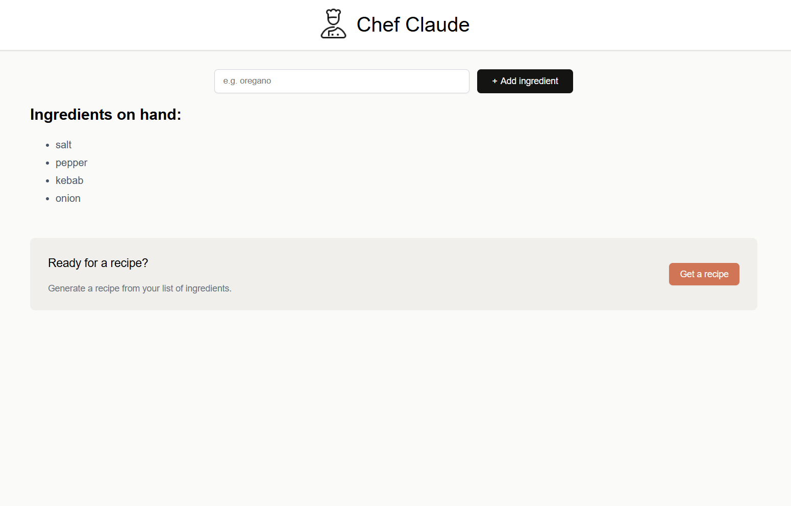

# Chef Claude

This is a solution to the [Chef Claude challenge on Scrimba React course](https://scrimba.com/learn-react-c0e).

You need to create your own API key on the [Hugging Face website](https://huggingface.co/) in order to test the application. You can attach the API key to your code by creating a .env file in the root of the project, where you write VITE_HF_ACCESS_TOKEN= followed by your generated API key.

:warning: Warning: Keep your API key secure and do not share it publicly. Exposing your API key can lead to unauthorized access to your account and may result in unexpected charges or data breaches. Always store your API key in a secure location, such as a .env file, and avoid hardcoding it directly into your source code.

### Built with

- Semantic HTML5 markup
- CSS custom properties
- React

### Screenshot

### What I learned

- API Integration
- Learned how to create API key and use it in application
- HTML and CSS Skills
- React Usage
- Component-Based Development
- State and Props
- React Hooks, such as useState and useEffect
- State Management
- User Interface Design
- Debugging and Problem-Solving
- Code Organization
